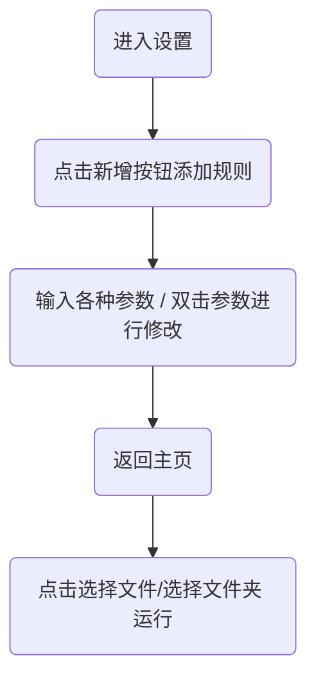

# ExcelConverter

## 简介

这是一个操作Excel文件（目前仅限\*.xls文件）的程序。通过自定义的规则，用户可以批量操作Excel文件。

## 使用步骤

## 参数说明

模式：

​	列模式按列访问文件

​	行模式按行访问文件

#### 下面以列模式为例

|      |        源文件        |     起始     |     终止     |         目标文件         |      起始      |
| :--: | :------------------: | :----------: | :----------: | :----------------------: | :------------: |
| 说明 | 源表格的列号（源列） | 源列的起始行 | 源列的终止行 | 目标表格的列号（目标列） | 目标列的起始行 |
| 示例 |          1           |      1       |      5       |            2             |       3        |

表示将 源表格 第一列 的 第一行至第五行 的 内容 复制 到 目标文件 第二列 第三行至第七行 处

### 几种操作

|   操作    | 源文件 | 起始 | 终止 | 目标文件 | 起始 | 命令 | 模板 |
| :-------: | :----: | :--: | :--: | :------: | :--: | :--: | :--: |
|   普通    |   √    |  √   |  √   |    √     |  √   | 可选 | 可选 |
| 新增行/列 |   ×    |  ×   |  ×   |    √     |  √   |  ×   |  √   |

### 命令

语法：(关键字, 操作数) 

| 关键字 |            flt             |           reg            |           str            |          dec          |
| :----: | :------------------------: | :----------------------: | :----------------------: | :-------------------: |
|  说明  |          筛选操作          |         正则操作         |        字符串操作        |       数字操作        |
| 操作数 |   字符串、&、\|、!的组合   |     python正则表达式     |     [整数a : 整数b]      |         整数r         |
|  示例  |      (flt, one\|two)       |        (reg, \d+)        |      (str, [0: -1])      |       (dec, 4)        |
|  意义  | 筛选出值为one或two的单元格 | 获取单元格值的第一串数字 | 去除单元格值的最后一个字 | 四舍五入，保留4位小数 |

#### flt

| 操作符 |             &              |             \|              |       !       |
| :----: | :------------------------: | :-------------------------: | :-----------: |
|  说明  |           逻辑与           |           逻辑或            |    逻辑非     |
| 操作数 |           字符串           |           字符串            |    字符串     |
|  示例  |           a & b            |           a \| b            |      ! a      |
|  意义  | 要求结果含有a和b（不可能） | 要求结果至少含有a b中的一个 | 要求结果不含a |

#### reg

篇幅过长

详见[python正则表达式]([Python 正则表达式 | 菜鸟教程 (runoob.com)](https://www.runoob.com/python/python-reg-expressions.html))

#### str

字符串Hello!

| 字符 |  H   |  e   |  l   |  l   |  o   |  !   |
| :--: | :--: | :--: | :--: | :--: | :--: | :--: |
| 索引 |  0   |  1   |  2   |  3   |  4   |  5   |
| 索引 |  -6  |  -5  |  -4  |  -3  |  -2  |  -1  |

[2: 4]的结果为ll

[2: -1]的结果为llo

[1: 6]的结果为ello!

#### dec

由于对于2.0000这类数字，在python中实际值为2.0

所以要保留小数尾部的0，只能靠字符串，导致目标表中该单元格的格式为 文本

有要求的用户需要自行修改单元格的格式

### 命令串

语法：(关键字, 操作数) -> (关键字, 操作数) -> ...

前一个命令的输出作为后一个命令的输入

多个命令串用 ; 分隔

### 模板

语法：字符串0{0}字符串1{1}字符串2...

对应命令串0、命令串1...

设命令串的结果为 结果0、结果1...

则最后生成的字符串为 字符串0结果0字符串1结果1字符串2...

#### 示例

{0}有{1}吨{2}

命令串结果 张三、1、大米

结果：张三有1吨大米
